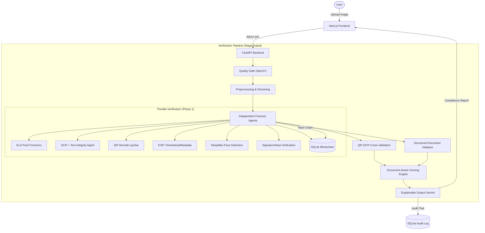

# 🛡️ SECUREAI-KYC — AI-Powered Fraud Detection

**SecureAI-KYC** is an intelligent, multi-agent KYC verification system designed to detect document fraud using advanced AI forensics. Built for the **Document Forgery Detection Blue Team Challenge** at the BITS Pilani Goa × IIT Madras National Hackathon, 2026.

Our pipeline covers the full challenge scope at a system-design level. Its strength is architectural — it combines 8 independent analysis layers rather than relying on a single ML classifier.

---

## 🏆 Blue Team Challenge Compliance

| Objective | Status | Implementation |
|-----------|--------|----------------|
| OCR + ML for text integrity analysis | ✅ | Font consistency, spatial layout, DCT double-compression, plus **Structured Semantic Validation** |
| Image processing for signature & seal verification | ✅ | HSV segmentation, Hough circles, Sobel edge sharpness (detects digitally pasted elements) |
| Blockchain integration for document verification | ✅ | SHA-256 + pHash immutable chain in SQLite (detects immediate resubmissions) |
| Detailed forensic reports with confidence scores | ✅ | 8-signal weighted scorer with document-type-aware modifiers and full signal breakdown |
| Multi-modal detection (visual + textual) | ✅ | Image forensics (ELA/EXIF) + Textual (OCR/Semantic) + ML (Deepfake) + Identity (QR-OCR) |

---

## 📁 Project Structure (Next.js + FastAPI)

| Layer | Directory | Description |
|-------|-----------|-------------|
| **Backend** | [`/backend`](./backend) | FastAPI + 8 forensic agents + SQLite Blockchain Ledger + Gemini Explainer. |
| **Frontend** | [`/frontend`](./frontend) | Next.js 16 dashboard with real-time pipeline visualization (Framer Motion). |

---

## 🏗️ System Architecture



---

## 🤖 Forensic Capabilities (8-Signal Scorer)

Our strongest deterministic ID capability is **QR-OCR cross-validation**. Our strongest validated capability for tabular documents is **Structured Document Validation**, which reliably targets NaviDoMass-style payslip edits.

| Signal | Description | Base Weight | Validated On |
|--------|-------------|--------|----------------|
| **QR-OCR Match** | Deterministic match between signed QR and printed text | 0.25 | Aadhaar, PAN (ID Cards) |
| **Structured Validation** | Character class (letters in money fields), format checksums, arithmetic math checks | 0.20 | NaviDoMass Forged Payslips |
| **ELA Forensics** | JPEG re-compression artifacts | 0.18 | Disconnected pixel manipulation |
| **ML Image Forgery** | MobileNetV2-based detection for splicing and copy-move | 0.15 | CASIA Image Tampering |
| **Signature/Seal** | Pasted element edge sharpness & seal circularity | 0.12 | Basic pasted components |
| **EXIF Flag** | Timestamp impossibility & editing software footprints | 0.10 | Non-scrubbed edited files |
| **Text Integrity** | Font, spatial, DCT compression & ORB copy-move | 0.10 | Crude copy-paste text edits |
| **Deepfake** | GAN/Diffusion artifact detection in faces | 0.07 | ID photo manipulation |
| **Blockchain** | Visual pHash + SHA-256 history verification | 0.05 | Re-submission attacks |

> **Note:** We map document types to expected features. A missing seal on a payslip shouldn't reduce trust, but an invalid arithmetic checksum will heavily penalize it. 

---

## ⚡ Performance Optimization
SecureAI-KYC is optimized for real-time applications, featuring:
- **Phase 1 Parallelization**: Forensic agents launch concurrently in a `ThreadPoolExecutor`.
- **Single-Pass OCR**: Text Integrity, Structured Validation, and Classification reuse a single EasyOCR scan.
- **Warm Preloading**: Models are pre-loaded on startup into a singleton layer.
- **Latency**: Sub-15 seconds for a complete parallel run.

---

## ⚖️ Regulatory Compliance & Explainability

Stage 7 implements **Explainable AI (XAI)**. Using the Gemini API and a context-aware prompt, SecureAI-KYC generates plain-English justification reports that cite the **RBI KYC Master Direction 2016** based on our 4-tier decision engine: `GENUINE`, `SUSPICIOUS`, `FORGED`, or `MANUAL_REVIEW`. A single weak signal anomaly never forces an outright rejection without corroboration.

---

## 📦 Getting Started

### 1. Prerequisites
- **Python**: 3.11+
- **Node.js**: v20+
- **API Key**: [Gemini API Key](https://aistudio.google.com/) (required for Stage 7)

### 2. Startup
```bash
# Terminal 1: Backend
cd backend && pip install -r requirements.txt
python main.py

# Terminal 2: Frontend
cd frontend && npm install && npm run dev
```

---

## 🔬 Hackathon Demo - The Dual Path

We recommend demonstrating two primary capabilities:

**Path 1: Deterministic Identity Fakes**
1. **Genuine Upload:** Upload a clean Aadhaar. Observe the green badge.
2. **Forged Upload:** Upload an Aadhaar with a renamed field but original QR.
3. **The Reveal:** Show how **QR-OCR Cross-Validation** (highest weight) instantly detects the mismatch.

**Path 2: Semantic Document Forgery (NaviDoMass)**
1. **Genuine Payslip:** Clean format passes all semantic checks.
2. **Forged Payslip:** Upload an altered NavidoMass payslip (e.g., character replacements in money fields).
3. **The Reveal:** Show how the **Structured Semantic Validator** catches broken arithmetic totals, invalid APE/SIRET formats, and letters hidden inside numeric fields—subtle changes that bypass standard image tampering filters.

---

## 🧪 Recommended Datasets

| Dataset | Documents | Forgery Types | Link |
|---------|-----------|---------------|------|
| **NaviDoMass** | 477 payslips, ~6000 forged chars | Character-level imitation, copy-paste | [Link](http://navidomass.univ-lr.fr/ForgeryDataset/) |
| **CASIA** | Comprehensive image tampering | Splicing, copy-move | [GitHub](https://github.com/greatzh/Image-Forgery-Datasets-List) |
| **DocTamper** | 170,000 documents | Copy-move, splicing, AI text | Academic |
| **FD-VIED** | DNN-generated forgeries | Text add/remove/replace | [arXiv](https://arxiv.org/abs/2311.03650) |

---

## ⚖️ License
MIT License. Created for the 2026 AI Hackathon by [@ZeroTrace7](https://github.com/ZeroTrace7).
