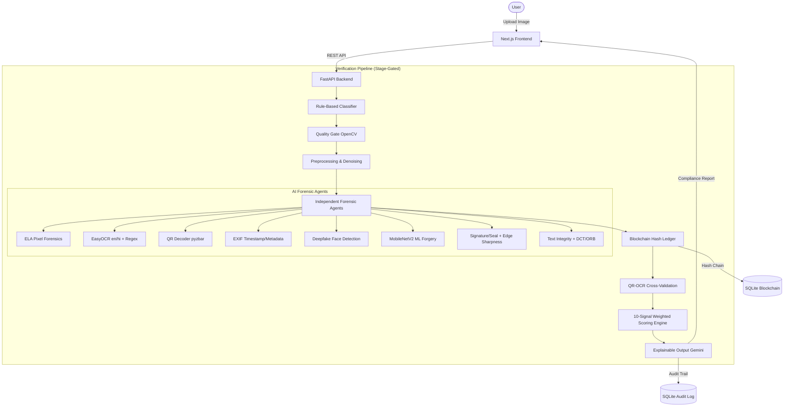

# 🛡️ SECUREAI-KYC — AI-Powered Fraud Detection

**SecureAI-KYC** is an intelligent, multi-agent KYC verification system designed to detect document fraud using advanced AI forensics. Built for the **Document Forgery Detection Blue Team Challenge** at the BITS Pilani Goa × IIT Madras National Hackathon, 2026.

---

## 📑 Technical Audit Report (March 2026)

> [!IMPORTANT]
> **Pre-Submission Audit Complete:** The system has undergone a brutal technical audit. 
> - **Score:** 9/10 (Ready for Submission)
> - **Key finding:** The QR-OCR cross-validation is a "superpower" deterministic signal.
> - **Full Report:** [audit_report.md](./audit_report.md)

---

## 🏆 Blue Team Challenge Compliance

| Objective | Status | Implementation |
|-----------|--------|----------------|
| OCR + ML for text integrity analysis | ✅ | Font consistency, spatial layout, DCT double-compression (frequency domain), ORB copy-move detection |
| Image processing for signature & seal verification | ✅ | HSV segmentation, Hough circles, Sobel edge sharpness (detects digitally pasted elements) |
| Blockchain integration for document verification | ✅ | SHA-256 + pHash immutable chain in SQLite (zero-cost, no gas fees) |
| Detailed forensic reports with confidence scores | ✅ | 10-signal weighted scorer (0-100) with full signal breakdown |
| Multi-modal detection (visual + textual) | ✅ | ELA + EXIF + OCR + QR + Deepfake + ML Forgery + Signature + Text Integrity + Blockchain |

---

## 📁 Project Structure (Next.js + FastAPI)

| Layer | Directory | Description |
|-------|-----------|-------------|
| **Backend** | [`/backend`](./backend) | FastAPI + 8 forensic agents + SQLite Blockchain Ledger + Gemini Explainer. |
| **Frontend** | [`/frontend`](./frontend) | Next.js 16 dashboard with real-time pipeline visualization (Framer Motion). |

---

## 🏗️ System Architecture



---

## 🤖 Agent Portfolio (10 Signals)

| Signal | Description | Weight | Implementation |
|--------|-------------|--------|----------------|
| **QR-OCR Match** | Deterministic match between signed QR and printed text | 0.25 | **Kill Feature** - pyzbar + fuzzy matching |
| **ELA Forensics** | JPEG re-compression artifacts (Heatmap) | 0.18 | Pillow + OpenCV pixel diff analysis |
| **Signature/Seal** | Pasted element edge sharpness & seal circularity | 0.12 | Sobel Edges + HSV segmentation |
| **EXIF Flag** | Timestamp impossibility & AI generator footprints | 0.10 | exifread + logical time constraint checks |
| **Text Integrity** | Font, spatial, DCT compression & ORB copy-move | 0.10 | Frequency domain analysis + ORB keypoints |
| **Blockchain** | Visual pHash + SHA-256 history verification | 0.08 | Perceptual hashing chain |
| **Deepfake** | GAN/Diffusion artifact detection in faces | 0.07 | dima806 transformers pipeline |
| **ML Forgery** | Document-level manipulation/splice detection | 0.05 | MobileNetV2 (kumaran-0188 classifier) |
| **Optional** | Voice match | 0.05 | Secondary signal |

---

## ⚖️ Regulatory Compliance: RBI KYC 2016

Stage 7 of our pipeline implements **Explainable AI (XAI)**. Using the Gemini API and a context-aware prompt, SecureAI-KYC generates plain-English rejection reasons that cite the **RBI KYC Master Direction 2016**, ensuring legal defensibility for banking institutions.

---

## 📦 Getting Started

### 1. Prerequisites
- **Python**: 3.11+
- **Node.js**: v20+
- **API Key**: [Gemini API Key](https://aistudio.google.com/) (required for Stage 7)

### 2. Startup
```bash
# Terminal 1: Backend
cd backend && pip install -r requirements.txt
python main.py

# Terminal 2: Frontend
cd frontend && npm install && npm run dev
```

---

## 🔬 Hackathon Demo - "The Golden Path"

1. **Genuine Upload:** Upload a clean Aadhaar. Observe the green badge and RBI-compliant explanation.
2. **Forged Upload:** Upload an Aadhaar with a renamed field but original QR.
3. **The Reveal:** Show how the **QR-OCR Cross-Validation** (25% weight) instantly detects the mismatch that a human eye would miss.

---

## 🧪 Recommended Datasets

| Dataset | Documents | Forgery Types | Link |
|---------|-----------|---------------|------|
| NaviDoMass | 477 payslips, ~6000 forged chars | Imitation, copy-paste | [Link](http://navidomass.univ-lr.fr/ForgeryDataset/) |
| FD-VIED | DNN-generated forgeries | Text add/remove/replace | [arXiv](https://arxiv.org/abs/2311.03650) |
| CASIA | Comprehensive tampering | Splicing, copy-move | [GitHub](https://github.com/greatzh/Image-Forgery-Datasets-List) |
| DocTamper | 170,000 documents | Copy-move, splicing, AI text | Academic |
| Roboflow Forgery | 402 image pairs | Annotated forgery regions | [Roboflow](https://universe.roboflow.com/document-forgery-detection/document-forgery-detection) |

---

## ⚖️ License
MIT License. Created for the 2026 AI Hackathon by [@ZeroTrace7](https://github.com/ZeroTrace7).
